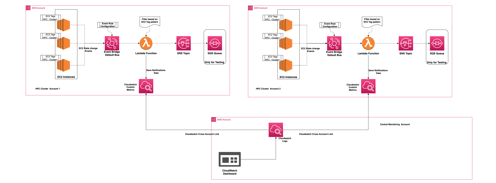
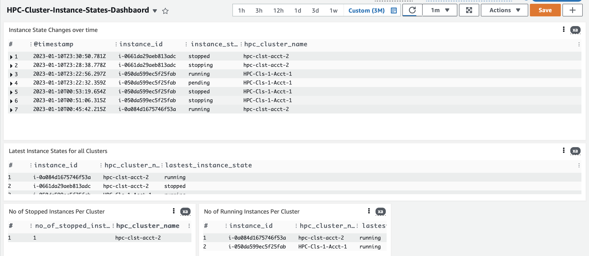

# This is a reference application for monitoring AWS EC2 HPC clusters across two accounts.

## Serverless HPC Cluster Monitoring using CloudWatch Cross-Account Observability.

<b>Description</b>:
This application demonstrates how different AWS services can be leveraged to monitor state changes for AWS EC2-based HPC clusters. It leverages AWS Lambda to perform filtering and message handling in conjunction with CloudWatch Cross-Account Observability and Amazon EventBridge to build a lightweight serverless monitoring architecture. This reference architecture is meant to serve as foundation and framework for further customized processing, sorting, presentation and notifications.

_<b>Use case 1</b>_: A customer organization has many separate divisions using separate AWS accounts deploying elastic EC2-based HPC clusters. A central IT admin group wants to monitor these resources in real time from a single centralized source to better manage workflows and to be aware of current resource utilization.

_<b>Use case 2_</b>: A third party partner is managing HPC deployments in customers account, but would like to be to help customers meter usage, create budgets, send notifications, and overall visibility into their HPC utilization. The customers also don’t want to share all logs and activities within an account with the partner, only the relevant HPC resources.

<b>Prerequisites</b>:

- Two or more AWS accounts (can be owned by different organizations).
  - One will be designated the “Centralized Monitoring” account
    - As the name implies, all HPC cluster statuses will be sent to this one account
  - One or more “HPC Cluster” accounts (in this example we will work with one HPC Cluster account, but simply redeploy the hpc-cluster-account stack and enable the connection to the additional accounts from the Centralized Monitoring account)
- Compute environment with access to the corresponding AWS credentials for each account.
  - It is possible to complete this with environment variables or other ways of storing AWS credentials and region preferences, but it is highly recommended that named profiles are used for deployment that the appropriate stacks are deployed to the intended account and region.
    - In these instructions, it will be assumed that a ‘hpc-cluster’ profile exists for the appropriate HPC Cluster account and region, and a ‘monitor’ profile exists for the appropriate Centralized Monitoring account and region.
- Compute environment with AWS Cloud Development Kit (AWS CDK) CLI installed.
  - Also, each AWS account and compute region where either the reporting or monitoring will need the AWS CDK bootstrapped before the stacks can be deployed there. \*For organizations with many accounts, this bootstrapping can also be performed using StackSets.
- All new or existing EC2 instances associated with an HPC Cluster deployment will require an additional EC2 Tag Key / Value with the appropriate query string (default: HPC). Any instances without this tag will not be monitored.
- Account IDs of the Centralized Monitoring account and of the HPC Cluster accounts. These IDs are needed to enable Amazon CloudWatch Cross-account Observability function.
- Amazon Cross-account Observability needs to be enabled and linked for between each HPC Cluster account to and from the Centralized Monitoring account. For step by step instructions, please follow this blog: https://aws.amazon.com/blogs/aws/new-amazon-cloudwatch-cross-account-observability/

## Solution



### Key Solution Aspects

- This reference application uses multi-account setup, which leverages two types of accounts.

  - <b>HPC Cluster Account(s)</b>
    These accounts are where the AWS EC2 instance based HPC compute clusters are deployed
  - <b> Centralized Monitoring Account</b>
    This will be a centralized account where one or more HPC cluster accounts will be sending cluster notification statuses.

This solution will have two primary functions:

1. In the cluster account, it will identify AWS EC2 instance state changes (start, stop, terminate) for instances that have been tagged [link to EC2 tagging] (either at launch or after the fact) with an identifier. The default tag string is “HPC”, either as part of the key name or the key value (it is recommended that this string can be customized further to prevent excess data transfer). Using a serverless AWS Lambda [link] function, these EC2 statuses will be filtered and only those matching the tag string will be passed to the monitoring account in the form of a CloudWatch log. This will limit the volume and type account activity being shared with the Centralized Monitoring account.
2. In the monitoring account, CloudWatch logs will be received and stored as a log group. This data will also contain the tag data from the HPC Cluster account. So additional meta data such as the user, project, workflow, cluster label, etc. can also be included for additional parsing and sorting. Here an end user, admin, or external partner can monitor currently running clusters or be notified when an instance or cluster has been stopped or terminated. \*Currently a basic dashboard using CloudWatch is being used to view the statuses, but it is recommended that this be extended by the customer or partner to group and organize the data further.

<b>HPC Cluster CDK Stack Components</b>

- Configure a Rule on Amazon EventBridge default event bus to subscribe to event all EC2 instance state change events (start, stop, terminate) and route those events to a custom Lambda function.
  o By default, when an EC2 instance state change occurs, the EC2 sends a message to the Amazon EventBridge default event bus.
- A custom Lambda function that filters for EC2 state change events that correspond with instances with the query string Tag Key / Value pattern.
- <b>Monitor state of EC2 instances across different clusters.</b>
  - Leverage the CloudWatch Cross-Account Observability feature.
  - Centralized monitoring account will have CloudWatch dashboard to display current state of all EC2 instances across different clusters.

## Deployments & Configurations

This application uses CDK Toolkit to deploy monitoring components.
Below are high level steps for deploying relative monitoring solution components across two different types of accounts, as mentioned above.

- Step 1 : Enable Cross-Account Observability feature on both Centralized account and HPC Cluster accounts. <br>

  Refer to section : [Enable Cross-Account Observability](#enable-cross-account-observability)

- Step 2 : Deploy notification components across HPC Cluster accounts.<br>
  As specified in deployment section update Configurations to match your environment.<br>
  [HPC Cluster Account Deployment](#hpc-cluster-account-deployment)
- Step 3: Deploy cloudwatch dashboard in Centralized Monitoring Account <br>
  Refer to Section :[Deployment Centralized Monitoring Account](#centralized-monitoring-account)
- Step 4: Refresh LogGroup configurations for Cloudwatch Dashboard in Centralized Monitoring Account <br>
  Refer to section : [CloudWatch Dashboard LogGroup Configuration Update](#cloudwatch-dashboard-log-group-configuration)

### Perquisites Steps

#### AWS CDK

The AWS CDK needs to be installed for the workstation(s) that will be deploying the CDK stack(s). If that hasn’t been installed, first ensure that the [AWS CDK Prerequisites](https://docs.aws.amazon.com/cdk/v2/guide/work-with.html "CDK Prerequisites") are installed including a compatible version of Node.js and the AWS CDK Toolkit.<br>

#### AWS CDK Python Setup

<details>
<summary><strong>Expand for detail on how to do this.</strong></summary><p>
Python is a fully-supported client language for the AWS CDK and is considered stable. Working with the AWS CDK in Python uses familiar tools, including the standard Python implementation (CPython), virtual environments with virtualenv, and the Python package installer pip. The modules comprising the AWS Construct Library are distributed via pypi.org. The Python version of the AWS CDK even uses Python-style identifiers (for example, snake_case method names).

You can use any editor or IDE. Many AWS CDK developers use Visual Studio Code (or its open-source equivalent VSCodium), which has good support for Python via an official extension. The IDLE editor included with Python will suffice to get started. The Python modules for the AWS CDK do have type hints, which are useful for a linting tool or an IDE that supports type validation.

To work with the AWS CDK, you must have an AWS account and credentials and have installed Node.js and the AWS CDK Toolkit. See AWS CDK Prerequisites.

Python AWS CDK applications require Python 3.6 or later. If you don't already have it installed,[download a compatible version](https://www.python.org/downloads/) for your operating system at [python.org](https://www.python.org/). If you run Linux, your system may have come with a compatible version, or you may install it using your distro's package manager (yum, apt, etc.). Mac users may be interested in [Homebrew](https://brew.sh/), a Linux-style package manager for macOS.

The Python package installer, pip, and virtual environment manager, virtualenv, are also required. Windows installations of compatible Python versions include these tools. On Linux, pip and virtualenv may be provided as separate packages in your package manager. Alternatively, you may install them with the following commands:

```
    python -m ensurepip --upgrade

    python -m pip install --upgrade pip

    python -m pip install --upgrade virtualenv
```

If you encounter a permission error, run the above commands with the --user flag so that the modules are installed in your user directory, or use sudo to obtain the permissions to install the modules system-wide.

Note

```
It is common for Linux distros to use the executable name python3 for Python 3.x, and have python refer to a Python 2.x installation. Some distros have an optional package you can install that makes the python command refer to Python 3. Failing that, you can adjust the command used to run your application by editing cdk.json in the project's main directory.
```

This project is set up like a standard Python project, virtualenv is created for this project and stored under the `.venv` directory, If for any reason you are unable to use pre-created virtualenv you can create the virtualenv manually.
Optional: Follow below steps only if you want to create virtualenv manually.
To manually create a virtualenv on MacOS and Linux:

```
python3 -m venv .venv
```

Activate your virtualenv

```
source .venv/bin/activate
```

If you are a Windows platform, you would activate the virtualenv like this:

```
.venv\Scripts\activate.bat
```

</p></details></br>

If the AWS CDK and its prerequisites have been installed in a Python environment, the next step is to bootstrap each AWS region and account where any CDK stack will be deployed. For this application, that means that the bootstrapping needs to occur at least twice: in the compute region for both the Centralized Monitoring and HPC Cluster accounts. This is a process that only needs to occur once per region per account, which means that every additional region requires bootstrapping of both accounts using `cdk bootstrap` command.

If you do not specify at least one environment in the cdk bootstrap command, it bootstraps all the environments referenced in the app.

If a stack is environment-agnostic (meaning it doesn't have an env property), then the CDK's environment is applied to make the stack environment-specific. The CDK's environment is the one specified using --profile or environment variables, or the default AWS environment otherwise that environment is then bootstrapped. <br>
**Note**:Throughout this documentation we use profile names as `hpc-cluster` and `centralized-monitor` to represent AWS account profile names for HPC Cluster accounts and Centralized monitoring accounts respectively.
If you have different profile names configured on CLI, please use appropriate profile names accordingly with `--profile` option for all CDK commands.

`cdk bootstrap' --profile hpc-cluster` <br>
`cdk bootstrap --profile centralized-monitor`

You can follow these reference for more information and guidance: [CDK bootstrap](https://docs.aws.amazon.com/cdk/v2/guide/bootstrapping.html)

### Application Download

#### Github Download

<details>
<summary><strong>Expand for detail on how to do this.</strong></summary><p>

Clone this sample repository and navigate to the `hpc-cluster-availability-notfn-reference-app` directory.
<br>TODO: Change below based on aws-samples location <br>
`git clone aws-samples/hpc-cluster-monitoring` <br>
`cd hpc-cluster-availability-notfn-reference-app`

</details>

### Application Deployment

#### Enable Cross-Account Observability

Before deploying any of the stacks, we need to enable the Cross-Account Observability feature on all accounts (the Centralized Monitoring Account and HPC Cluster Accounts).

There is a quick reminder that cross-account observability only works in the selected Region. If you have HPC Cluster accounts in multiple Regions, you can configure cross-account observability in each Region & [deploy Centralized Monitoring Dashboard](#centralized-monitoring-account) in each region.

- First enable [Centralized Monitoring Account](https://docs.aws.amazon.com/AmazonCloudWatch/latest/monitoring/CloudWatch-Unified-Cross-Account-Setup.html#Unified-Cross-Account-Setup-ConfigureMonitoringAccount) as Monitoring Account in CloudWatch.
  In the CloudWatch console, choose Settings in the navigation pane. In the Monitoring account configuration section, choose Configure.
- Now can choose which telemetry data can be shared with the monitoring account: Logs, Metrics, and Traces, leave all three enabled. For this example at minimum `Logs` option is required to be enabled.

- In list the source accounts configuration, add account ids for all HPC Cluster Accounts, which will share data with this Centralized Monitoring account.<br>

  The monitoring account is now enabled, choose Resources to link accounts to determine how to link my source accounts.

- To link each HPC Cluster accounts, you can either download a CloudFormation template to be deployed in each HPC Cluster account or copy a URL that can be used in the console to set up the accounts. <br>
  Please note the CloudFormation template / URL is specific to each HPC Cluster account to be linked.
- Log into HPC Cluster Account AWS Console and either use download CloudFormation template or copy-pasted the URL previous step.
- Deploy CloudFormation Template <br>
  Repeat above two steps for each HPC Cluster Account.

For details instructions follow all the steps from `Configuring CloudWatch Cross-Account Observability` section of
[ Blog](https://aws.amazon.com/blogs/aws/new-amazon-cloudwatch-cross-account-observability/)

**Note** `source account` mentioned in blog refers to `HPC Cluster Account` in this example.

#### HPC Cluster Account Deployment

#### CDK Deployment

Before starting, please ensure that all of the prerequisites are in place, including the CDK bootstrapping of the Centralized Monitoring Account and region(s). This deployment is independent of the HPC Cluster stack, so these stacks do not need to be deployed in any specific order. Please note that to monitor multiple regions, this stack needs to be re-deployed into each corresponding region as well.

Switch to the HPC Cluster CDK Stack directory

```
cd cdk/hpc-cluster-account
```

Install the required dependencies:

```
pip install -r requirements.txt
```

#### Optional Tag Query String Configuration

Before deploying the stack, any customizations to the default tag query string can be made here. The tag query string is defined as the`EC_TAG_KEY_PATTERN` variable in app.py. It is set as “HPC” by default. Update this variable in app.py to match Tag Key defined for all EC2 instances based HPC Clusters to monitor. [link to EC2 tags] A more unique string recommended if many other automated tags are also used in this account that may accidentally trigger a false positive.

#### Deploy CDK Stack

At this point you can now synthesize the CloudFormation template for this code.

```
cdk synth
```

To deploy the HPC Cluster components to the appropriate profile (account and region):

```
cdk deploy --profile hpc-cluster
```

#### Centralized Monitoring Account

##### <b>Check Prerequisites</b>

Before starting, please ensure that the Prerequisites are in place, including the CDK bootstrapping of the Centralized Monitoring Account and region(s). This deployment is independent of the HPC Cluster stack, so these stacks do not need to be deployed in any specific order. Please note that to monitor multiple regions, this stack needs to be re-deployed into each corresponding region as well.

Switch to Centralized Monitoring Account CDK stack directory:

```
cd ../centralized-monitoring-account
```

#### Deploy CDK Stack

Install the required dependencies:

```
pip install -r requirements.txt
```

At this point you can now synthesize the CloudFormation template for this code:

```
cdk synth
```

To deploy the Centralized Monitoring components to the appropriate profile (account and region):

```
cdk deploy --profile monitor
```

### CloudWatch Dashboard Log Group Configuration

Once deployment is complete for all the required accounts (Monitoring and HPC Cluster), follow below steps to in the Centralized Monitoring account to refresh the included CloudWatch Dashboard with the log groups sent from all of the HPC Cluster Accounts.<br>
[CloudWatch Dashboard LogGroup Configuration](./cdk/centralized-monitoring-account/Clodwatchdash-Logroup-Configuration.md)

\*Note that this is an optional step, only included here to visualize and validate the logs that are being shared to the monitoring account. The primary purpose of this architecture is to create a secure and robust framework to share the cluster statuses between accounts. This framework is greatly extensible, and the data itself can be leveraged in with much more involved filtering, grouping, logging, historical trends, alarms, and notifications with additional third party tools such as Grafana or Datadog.

## Testing

Validation Steps

1. Log into AWS Console or setup AWS CLI credentials for HPC Cluster Accounts.
   Create Test 2-3 EC2 instances with Tag Key or Tag Value matching the pattern specified in app.py
2. Change the state of instances (Star, Stop, Terminate)
3. Log into Centralized Monitoring Account AWS console, navigate to Cloudwatch->Dashboards->HPC-Cluster-Instance-States-Dashboard
   Note: You may have to select "Cloudwatch log groups" in each of dashboard panels. Select Cloudwatch log group name "/aws/lambda/hpc-cluster-notifications-function" from all different HPC Cluster Accounts



## Uninstalling

#### HPC Cluster Accounts Deployment Cleanup

Set [AWS account credentials](https://docs.aws.amazon.com/cli/latest/userguide/cli-configure-quickstart.html) for HPC Cluster AWS Account on CDK CLI.

To cleanup all components use CDK destroy.

```
cd ../hpc-cluster-account
```

```
cdk destroy --all
```

#### Centralized Monitoring Account Cleanup

Set [AWS account credentials](https://docs.aws.amazon.com/cli/latest/userguide/cli-configure-quickstart.html) for Centralized Monitoring Account on CDK CLI.

To cleanup all components use CDK destroy.

```
cd ../centralized-monitoring-account
```

```
cdk destroy --all
```
