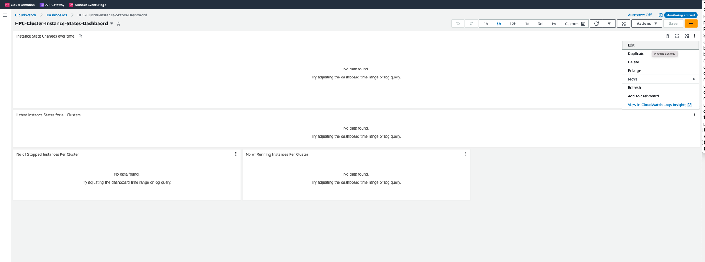
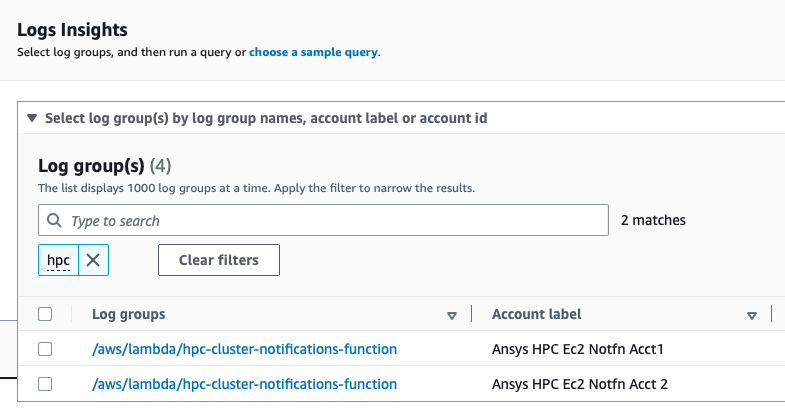
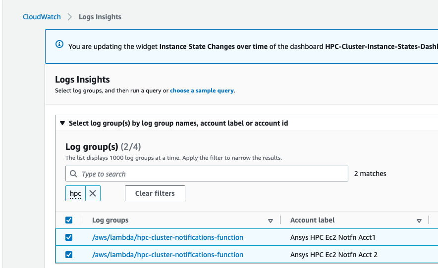
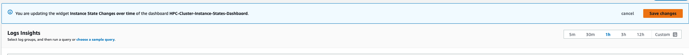
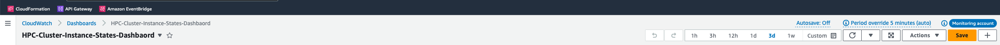

<b>Step 1: Login to AWS Console for Centralized Account </b> 
<b>Step 2: Navigate to CloudWatch > Dashboards > HPC-Cluster-Instance-States-Dashboard </b> 
 
<b>Step 3: For First Widget (Instance State Changes Over Time) select Edit option from right hand side menu, refer to below screenshot </b> 
 
  
 
<b>Step 4: This will open Log Insights page, on this page Select LogGroups with "/aws/lambda/hpc-cluster-notifications-function" name from all different Individual Accounts mapped to Monitoring Account. </b> 
 
 
<b>Step 5: Save changes in LogInsights Page, this will update the Dashboard configuration for the specific widget. </b> 
<b>Repeat this process (Step 3 -5) for three remaining the Widgets on Dashboard. </b> 
 
 
 
 
<b>Step 6: Once all Widgets are updated, then Save the dashboard configuration by clicking Save on Top of Dashboard. </b> 
 
  
 
